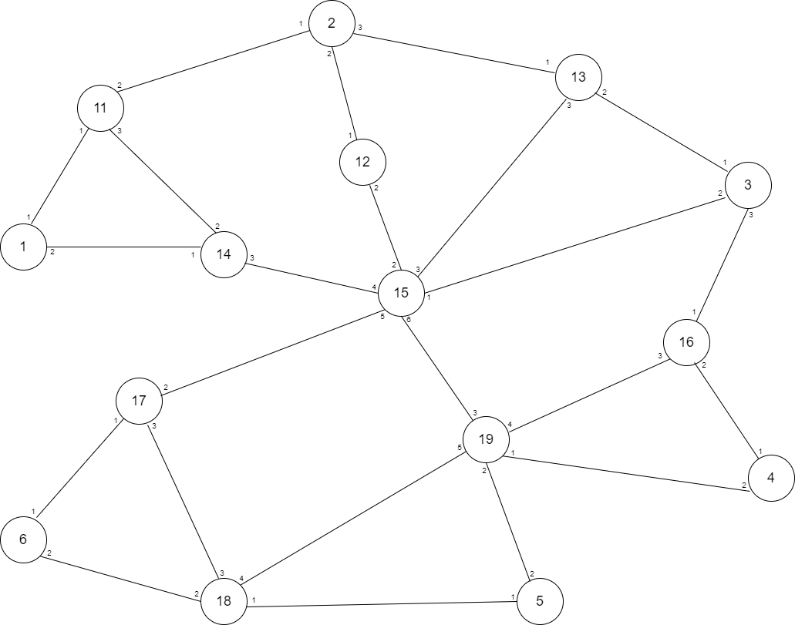

Test number 1
=============

This test uses the following topology:

   Test topology.

   The circles represent the switches. Switches numbered 1 to 6 have the NNIs.
   Each of those 6 switches have 3 NNIs.
   The small numbers are the ports.

There are 18 client's switches, 3 connected to each of the switches numbered
1 to 6. Client switches connected to switch 1 are 101, 102 and 103. Client
switches connected to switch 2 are 201, 202 and 203, and so on.
After the topology is created, the following EVCs are created:

``102 <--> 603``

``101 <--> 602``

``201 <--> 503``

``402 <--> 103``

``303 <--> 601``

``202 <--> 302``

``102 <--> 501``

``401 <--> 601``

The EVC ``101 <--> 602`` has a primary path ``1 - 14 - 15 - 17 - 6``. The
others have no primary path.
Then, a maintenance window is created for switch 15, and all EVCs using that
switch are moved to another path. When the maintenance ends, EVC
``101 <--> 602`` returns to its primary path. The others remain with the path
they were moved to.
